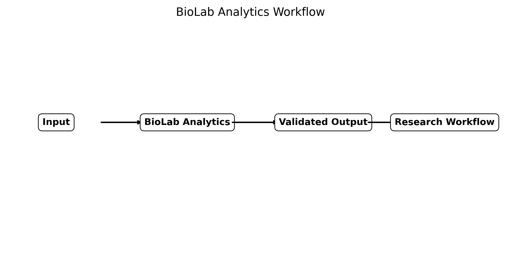

# BioLab Analytics

**A practical quantitative biosciences workspace for laboratory calculations, experimental planning, and reproducible bench-to-bioinformatics workflows.**


BioLab Analytics provides working calculators through both an interactive Streamlit dashboard and a command-line interface.

---

## Live Dashboard

After deployment, add your Streamlit link here:

```text
🚀 **Live Dashboard:** https://biolab-analytics.streamlit.app/
```

---

## Dashboard

Run locally:

```bash
streamlit run dashboard/app.py
```

The dashboard includes:

- Solution chemistry
- Dilutions and serial dilutions
- Microbiology
- Molecular biology
- Cell culture
- Sequencing and genome coverage
- Calculation history
- CSV downloads for reusable results

---

## Workflow



---

## Core Calculators

| Module | Calculators |
|---|---|
| Solution Chemistry | Molarity, molarity from mass, %w/v, %v/v |
| Dilutions | C1V1=C2V2, serial dilution planner |
| Microbiology | CFU/mL, growth rate, doubling time |
| Molecular Biology | DNA copy number, PCR mastermix |
| Cell Culture | Cell seeding, viability, population doubling time |
| Sequencing | Coverage, reads required |

---

## Installation

```bash
git clone https://github.com/YOUR_USERNAME/BioLab-Analytics.git
cd BioLab-Analytics
pip install -r requirements.txt
pip install -e .
```

---

## Command-Line Examples

```bash
python -m biolab_analytics.cli molarity --molarity 1 --volume-l 1 --mw 58.44
python -m biolab_analytics.cli dilution --c1 100 --c2 1 --v2 100
python -m biolab_analytics.cli cfu --colonies 120 --dilution 1e-6 --volume-ml 0.1
python -m biolab_analytics.cli coverage --reads 1000000 --read-length 150 --genome-size 5000000
```

---

## Validation

Run tests:

```bash
pytest
```

---

## Scientific Basis

BioLab Analytics implements standard quantitative relationships used in bioscience laboratories:

```text
mass (g) = molarity × volume × molecular weight
C1V1 = C2V2
CFU/mL = colonies / (dilution × plated volume)
coverage = reads × read length / genome size
```

---

## Intended Users

- Biology and biotechnology students
- Molecular biology researchers
- Microbiology laboratories
- Genomics researchers
- Teaching laboratories
- Early-career scientists building reproducible workflows

---

## Limitations

BioLab Analytics supports planning and routine calculations. It does not replace laboratory SOPs, validated clinical procedures, institutional safety protocols, or researcher judgment.

---

## Author

**Muhammad Bilal**  
PhD Student, Biological and Biomedical Sciences  
Oakland University, Rochester, Michigan, USA

---

## Citation

Bilal M. *BioLab Analytics: A quantitative biosciences workspace for laboratory calculations, experimental planning, and reproducible research workflows*. GitHub repository.

---

## License

MIT License
